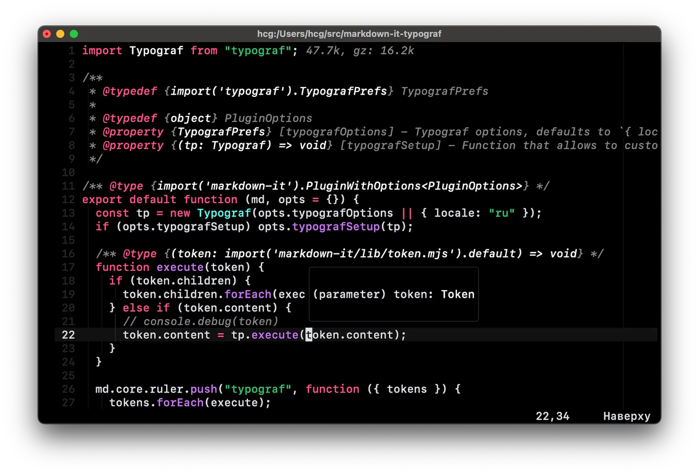

# 🎨 Vercel



Neovim clone of [vscode theme](https://github.com/triyanox/vercel-theme).
Initially converted via [djanho](https://github.com/arcticlimer/djanho) + some of my tweaks.

## Setup

### [Lazy.nvim](https://lazy.folke.io)

```lua
return {
  "https://github.com/ceigh/vercel-theme.nvim",
  lazy = false,
  priority = 1000,
  config = function()
    vim.cmd("colorscheme vercel")
  end,
}
```

## Disclaimer

This theme is inspired by [Vercel](https://vercel.com) and I don't have any relevant experience building themes, so you may encounter some bugs. If you do, please open an issue, and I'll try to fix it as soon as possible.
